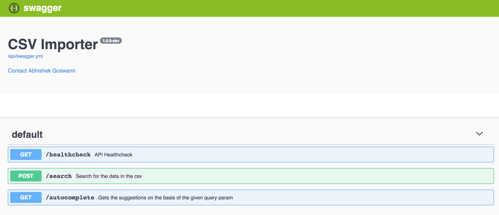

# CSV-IMPORT BACKEND

### Please read this :P !

## Approach
Task is simple, to **read a csv file and perform search for data from the file**.

Now the file can be small or huge in size. Let's say the file is big, what now ?

Reading the whole **big file at once in the memory can be dangerous**, if the file is huge, it will consume a lot of memory and can lead to crash of the application.

What other option do we have ?

**STREAMS TO THE RESUCE !**

Node streams are awesome! The idea is simple , instead of reading the whole file at once, we read it into parts and consume it or perform operation on it.

This way, we don't have to load the whole file into memory at once and can read a huge file into pieces easily.

AWESOME!

In this case, I simply read the file using read streams.

Now the csv file needed to be converted into the object format to perform operation on it, so i converted the each csv record into json object using csv-streamify module.

Now there is another awesome thing is streams,

**TRANSFORM STREAMS**

So, Node.js transform streams are streams which read input, process the data manipulating it, and then outputing new data.

So i used it to create the filters to get the required data as shown below :

I created my own **custom transform streams** using Transform abstract class as shown :

```
  import { Transform } from 'stream'

  const queryFilter = new Transform({ objectMode: true })

  queryFilter._transform = function t(data, encoding, done) {
    // query is the data we need
    if (data.includes(query)) {
      this.push(getFormattedData(data))
    }

    done()
  }
```

The above transform stream simply reads the data and passes the data which matches our query forward.

The best part is we can simply, pipe the data to it and get the output as shown :

```
  fs.createReadStream(file)
    .pipe(csvToJson)
    .pipe(queryFilter)
```

This way things became really easy and we can get the desired output.

**OR**

The other approach or solution could be to simply get the file, read the file using streams and dump the whole file data into mongodb.

Now can read the data on the basis of the given query from mongo.

### Caching

I implemeted a simple dumb cache for now, in which i just set the data i have searched or query for, from the csv and store it.

So if the next time, the request comes again for the same query, data can be returned from the cache itself.

Note: It's not a good solution for now!

Good solution would be to make the use of **redis** for storing cache, that way it would be more flexible and can be shared among other services too.

## APIS
I have added swagger to the app, so once the app is running , can go to `http://localhost:3000/api`, which will contain the swagger docs

endpoint `/` : Renders the home page from the frontend dir

---

endpoint `/import` : Uploads the csv file to the server

method: `POST`

Request:

```
form-data: file ( file data that needs to be uploaded )
```

Response:
```
status: 200
OK
```

---

endpoint `/search` : Get the data for the given `query` from the csv file

method: `POST`

Request Paylod:
```
{
	"query": "<query string>"
}
```

Response:
```
{
    "success": true,
    "result": <array of the user details >
}
```

**Example**

Request Paylod:
```
{
	"query": "Alfred Castillo"
}
```

Response:
```
{
    "success": true,
    "result": [
        {
            "id": "3293",
            "name": "Alfred Castillo",
            "age": "29",
            "address": "Desok Glen, 660 Cumona Point",
            "team": "BLUE"
        },
        {
            "id": "88740",
            "name": "Alfred Castillo",
            "age": "63",
            "address": "Uhume Grove, 1372 Etuzi Terrace",
            "team": "GREEN"
        }
    ]
}
```
---
endpoint `/autocomplete` : Get the data suggestions for the given `query` from the csv file

method: `GET`

Request Parameters:
```
query: The string to search in the data
field: The field value to search in data, eg AGE, NAME, ADDRESS etc
limit: The no of values to fetch
```
`http://localhost:3000/autocomplete?query=:query&field=:field&limit=:limit`

Response Payload:
```
{
    "success": true,
    "result": <array of the user details >
}
```

**Example**

Query for the name field

Request Parameters:
```
http://localhost:3000/autocomplete?query=Alfred&field=name&limit=10
```

Response Payload:
```
{
    "success": true,
    "result": [
        {
            "id": "1853",
            "name": "Alfred Tate",
            "age": "57",
            "address": "Ehodih Lane, 1964 Saros Square",
            "team": "YELLOW"
        },
        {
            "id": "2163",
            "name": "Alfred Kim",
            "age": "31",
            "address": "Kire Drive, 146 Meki Circle",
            "team": "WHITE"
        },
        {
            "id": "2937",
            "name": "Alfred Park",
            "age": "52",
            "address": "Jafcu Loop, 427 Merfah Pass",
            "team": "GREEN"
        },
        {
            "id": "3293",
            "name": "Alfred Castillo",
            "age": "29",
            "address": "Desok Glen, 660 Cumona Point",
            "team": "BLUE"
        },
}
```

or

Query for the age field

Request Paramteres
```
http://localhost:3000/autocomplete?query=24&field=age&limit=10`
```

Response
```
{
    "success": true,
    "result": [
        {
            "id": "11",
            "name": "William Maldonado",
            "age": "24",
            "address": "Komiku Parkway, 1409 Ulenu Road",
            "team": "YELLOW"
        },
        {
            "id": "12",
            "name": "Austin May",
            "age": "24",
            "address": "Ujud Avenue, 1299 Iztik Boulevard",
            "team": "YELLOW"
        },
        {
            "id": "89",
            "name": "Joe Kim",
            "age": "24",
            "address": "Fovod Manor, 1442 Umjud View",
            "team": "YELLOW"
        },
        {
            "id": "114",
            "name": "Lora Stevenson",
            "age": "24",
            "address": "Kutes Court, 1226 Bumtu Drive",
            "team": "RED"
        },
        {
            "id": "168",
            "name": "Bertha Elliott",
            "age": "24",
            "address": "Eteed Heights, 1759 Piho Ridge",
            "team": "WHITE"
        },
        {
            "id": "188",
            "name": "Della Hammond",
            "age": "24",
            "address": "Wadhe Pass, 567 Fozat Point",
            "team": "BLUE"
        },
        {
            "id": "224",
            "name": "Frank Payne",
            "age": "24",
            "address": "Nupa Avenue, 512 Nucif Court",
            "team": "RED"
        }
    ]
}
```

or

Query for the id field

Request Paramteres
```
http://localhost:3000/autocomplete?query=11&field=id&limit=10`
```

Response
```
{
    "success": true,
    "result": [
        {
            "id": "11",
            "name": "William Maldonado",
            "age": "24",
            "address": "Komiku Parkway, 1409 Ulenu Road",
            "team": "YELLOW"
        }
    ]
}

```

## How to run
### Build the ReactJS Frontend
Go to the frontend dir
```
cd frontend
```

Build the main `app.js` file
```
yarn build or npm run build
```


### Build the backend
Go to the `backend` directory :
```
cd backend
```

```
yarn or npm install
```

```
yarn run build or npm run build
```

```
yarn run start or npm run start
```

This will start the service at port `3000`, to get the access to the service endpoints, i have added **swagger** to the app, which can be accessed at `http://localhost:3000/api`.

**Other commands**

To run the build and watch at the same time for changes
```
yarn run build:watch or npm run build:watch
```

To run the server and watch at the same time for changes
```
yarn run start:watch or npm run start:watch
```

Lint command
```
yarn lint or npm run lint
```

Static Validation or flow check
```
yarn flow or npm run flow
```

**Docker commands**

To build docker image

```
yarn run docker:build
```

To run docker image

```
yarn run docker:run
```

## Technologies
**Node.js** >= 10

**Koa** Web Framework. Koa is really good, supports promise based middleware.

**ES6**

**Flow** for static validation in JS

**Babel** for transpiling

**eslint** for style validation, used airbnb-eslint

Jest: Testing

**Docker**

## Improvements

Use Redis for the cache implementation

## Snapshots

Swagger

