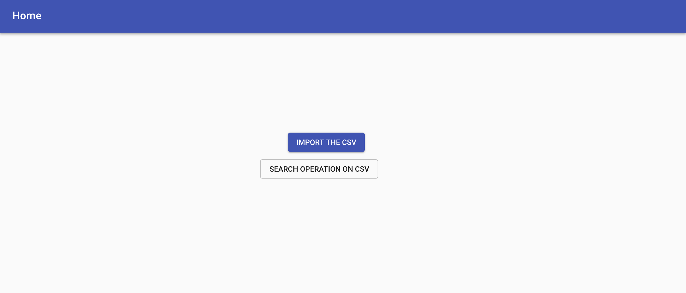
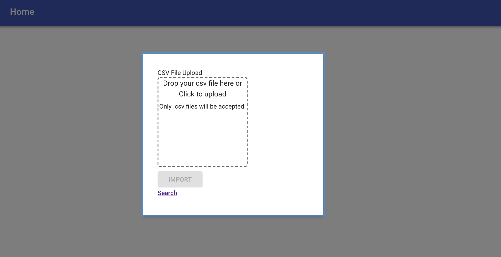
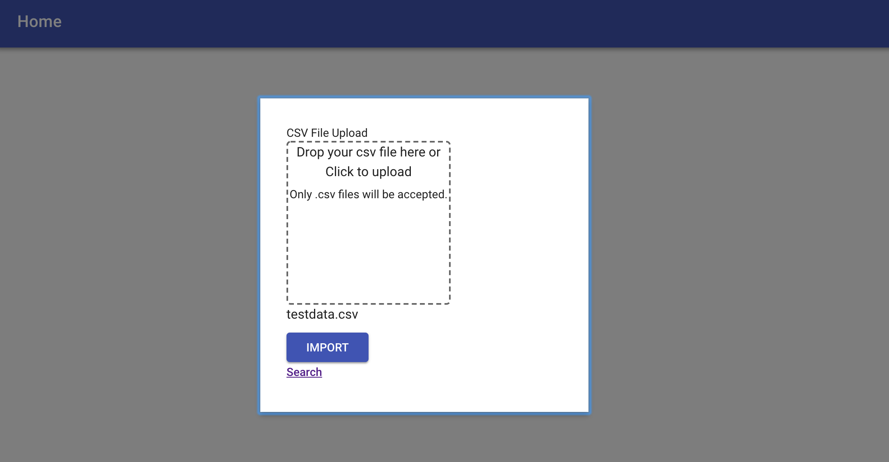
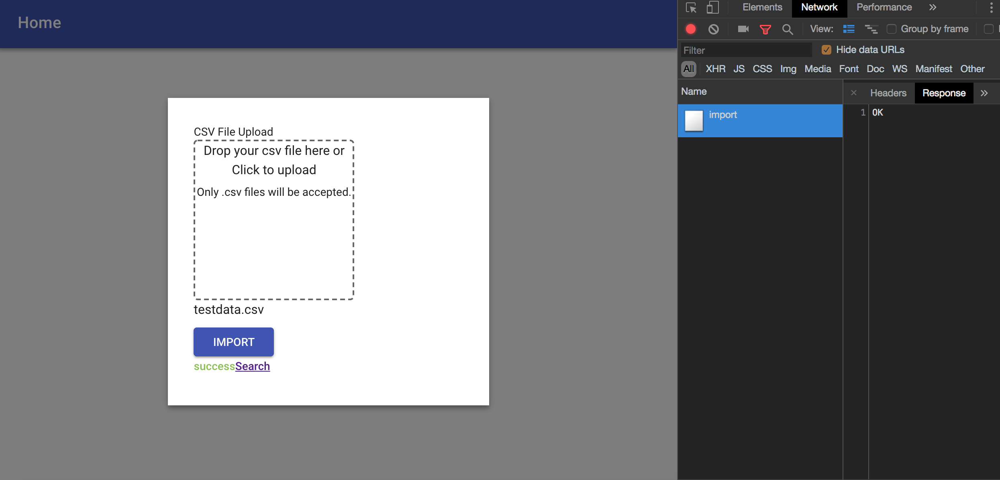
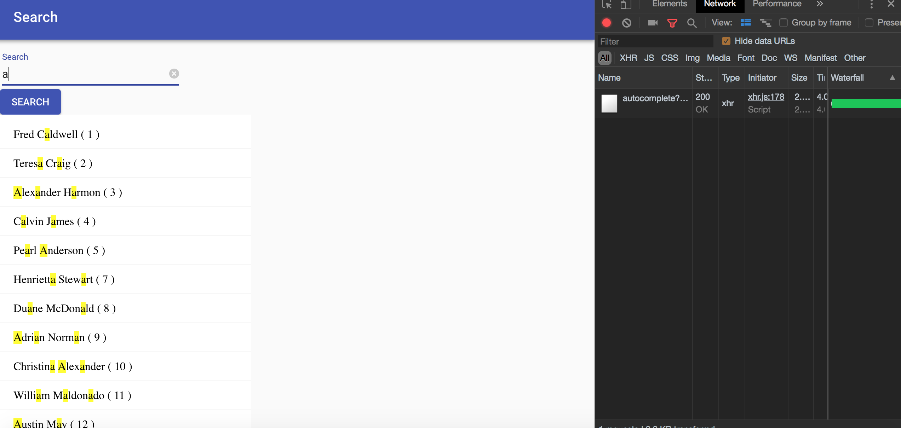
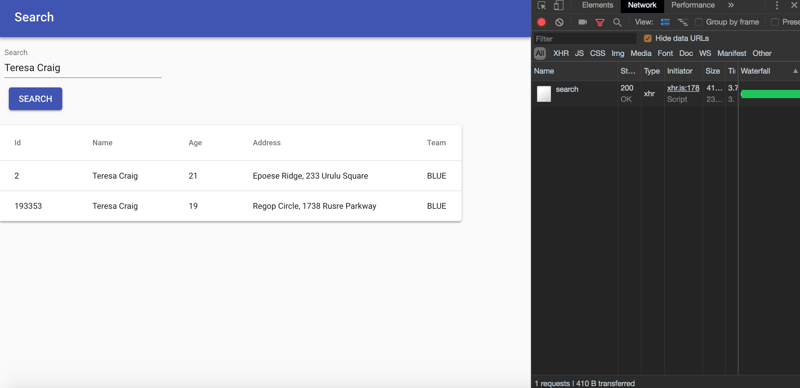

# CSV-IMPORT FRONTEND

### Please give a read :P

The front-end is a **Single Page Application** ( it looks shit :p , I just focussed on the functionality for now )
made in **React.JS** and can do :

Select or dropdown the file to import.

Send the file to the server to upload.

Search page to search the data from the uploaded csv file.

Search page has the autocomplete feature to get the suggestions.
The request made to server is **debounced** to minimize the number of requests made to the server.

### How to Run
Build the main js file

```
yarn build or npm run build
```

This will create the main app.js file in the dist/ dir.

For development purposes, use the webpack dev server

To start the webpack server
```
yarn start or npm run start
```

will start the dev server at port 3000, `http://localhost:3000`

**Other commands**
To check the lint errors
```
yarn lint or npm run lint
```

To check for flow
```
yarn flow or npm run flow
```

Test
```
yarn test or npm run test
```
### Snapshots
The index page or home page

It gives the option to the user to import the csv file or go to the searh page to query from the imported csv file.


This shows the upload model, where user can drag a csv file or select a csv file to upload


Once the user has selected a csv file, he is shown the name of the selected file and gets the import option active, to send the file to server.


Once the user click on the Import option, the file sends the request to the `/import` endpoint and gets uploaded to the server.
The loader is shown to show the progress and after success, the success message is shown at the bottom.


This shows the search Page, where user can query the data from the imported csv file.


When user search for something, the autocomplete feature shows the suggestions to the user as show.
The request is made to the server on the  `/autocomplete` endpoint.


The user makes request to `/search` endpoint, to get the info for the query in the textfield, and the complete fetched result is shown to the user.

This data is cached on the backend for faster access.


### Technologies

**React 16**

**Material UI** 

**es6**

**babel** for transpiling

**webpack** for file bundling ( hot reoload )

**eslint** for style checking

**flow** for static type validation in JS

**jest** and **enzyme** for testing

### Todo

Code can be improved more by implementing HOC (High order components)

Do cache handling on the front-end

Use service workers for offline caching
